Path Tracer Part I: Naive Integration, Sampling Functions, and Diffuse Materials----Name: Runjie Zhao ID:34492649
======================
**Runjie Final Result**
Overview
------------
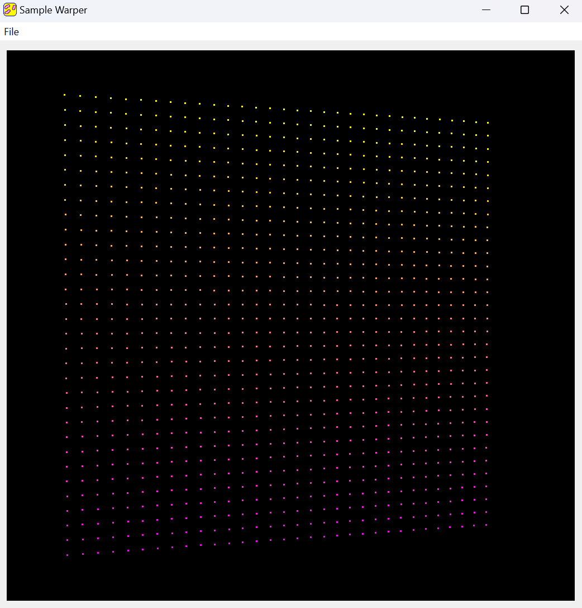
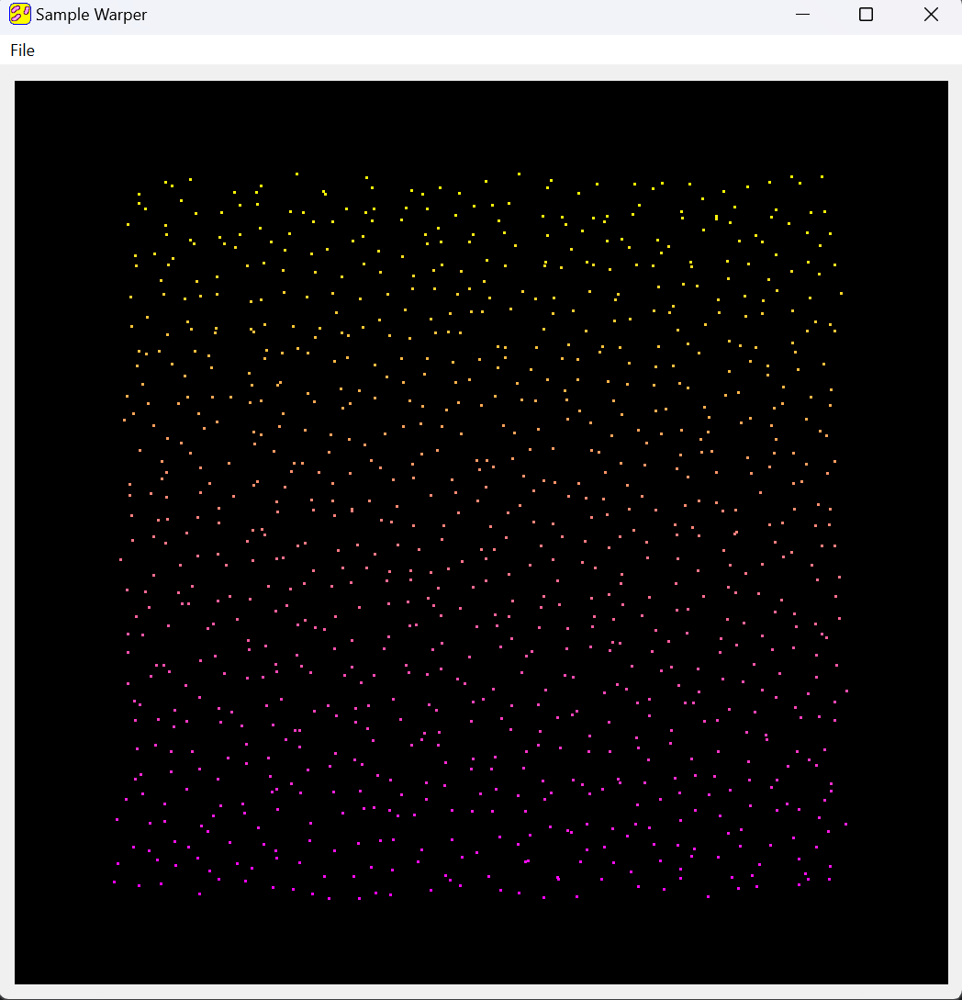
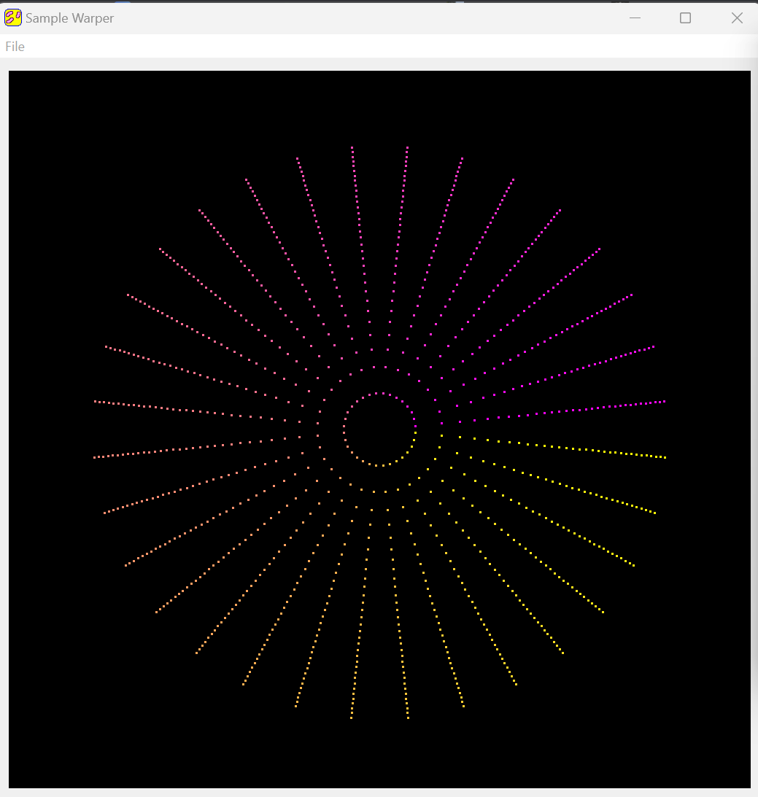
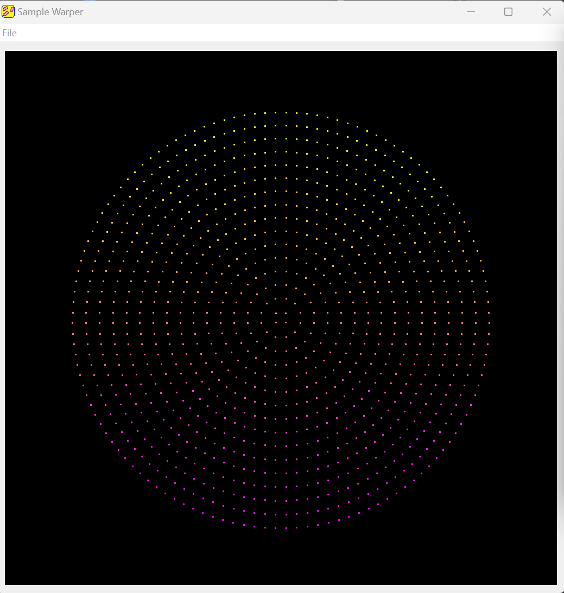
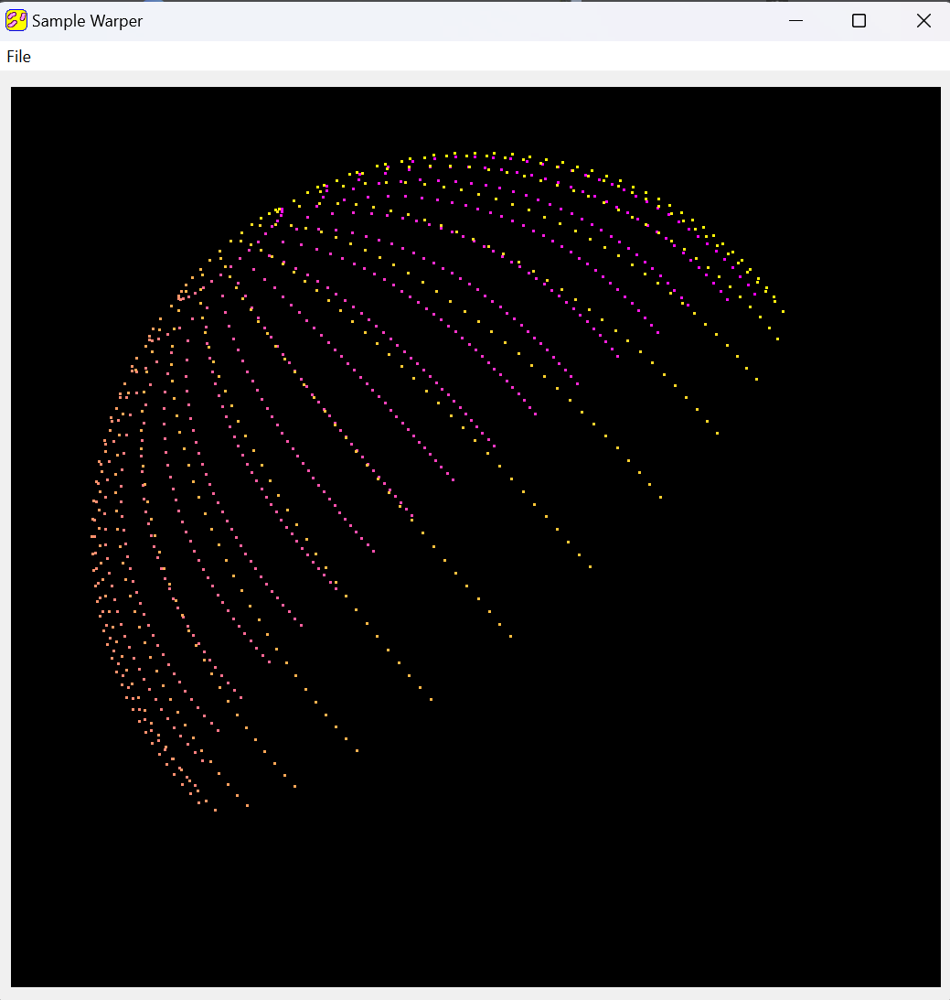
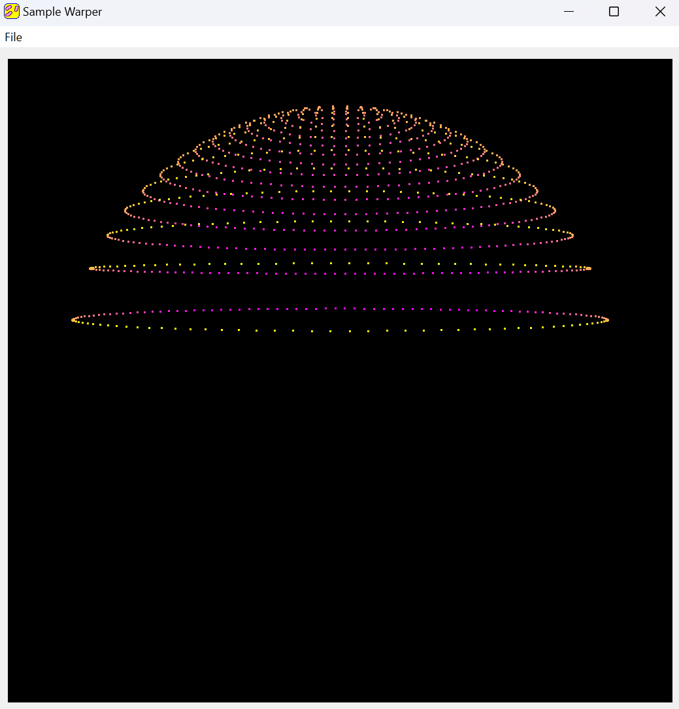
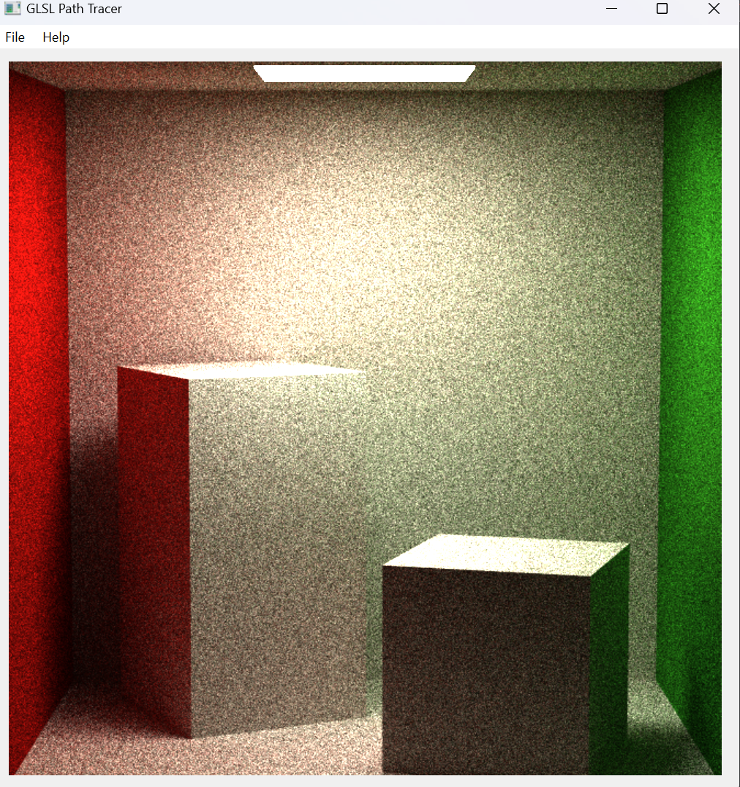
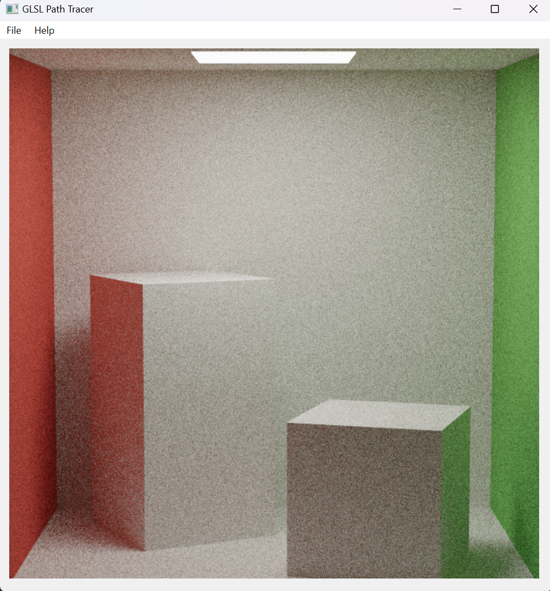

**University of Pennsylvania, CIS 561: Advanced Computer Graphics, Homework 2**

Overview
------------
This homework assignment marks the beginning of your implementation of a Monte Carlo
path tracer. You will work within two code bases for this assignment. The first
allows you to test a collection of functions that allow you to generate sample
points in a variety of domains. Sampling the surfaces of different shapes is very
important in a path tracer; not only does one have to cast rays in random
directions within a hemisphere, but if one wants to sample rays to area
lights, one needs to sample points on the surfaces of these lights.

The second code base is the actual path tracer code you will work with
for the next few weeks. You will implement a na&#239;ve Monte Carlo path
tracer by writing functions to generate random ray samples within a
hemisphere so that you can compute the lighting a surface intersection receives.
You will also implement the bidirectional scattering distribution function of
a simple Lambertian diffuse material. The most important
part of this assignment is reading through the base code and understanding how
all of the path tracer's components work together to produce an image.

Useful Reading
---------
You will find the textbook to be very helpful when implementing
this homework assignment. We recommend referring to the following chapters:
* 7.1 - 7.3: Sampling and Reconstruction
* 8.1: Basic Reflection Interface
* 8.3: Lambertian Reflection
* 9.1: BSDF
* 9.2: Material and Interface Implementations
* 5.4: Radiometry
* 13.1 - 13.3: Monte Carlo Integration

The Light Transport Equation
--------------
#### Lo(p, &#969;o) = Le(p, &#969;o) + &#8747;S f(p, &#969;o, &#969;i) Li(p, &#969;i) V(p', p) |dot(&#969;i, N)| _d_&#969;i

* __Lo__ is the light that exits point _p_ along ray &#969;o.
* __Le__ is the light inherently emitted by the surface at point _p_
along ray &#969;o.
* __&#8747;S__ is the integral over the sphere of ray
directions from which light can reach point _p_. &#969;o and
&#969;i are within this domain.
* __f__ is the Bidirectional Scattering Distribution Function of the material at
point _p_, which evaluates the proportion of energy received from
&#969;i at point _p_ that is reflected along &#969;o.
* __Li__ is the light energy that reaches point _p_ from the ray
&#969;i. This is the recursive term of the LTE.
* __V__ is a simple visibility test that determines if the surface point _p_' from
which &#969;i originates is visible to _p_. It returns 1 if there is
no obstruction, and 0 is there is something between _p_ and _p_'. This is really
only included in the LTE when one generates &#969;i by randomly
choosing a point of origin in the scene rather than generating a ray and finding
its intersection with the scene.
* The __absolute-value dot product__ term accounts for Lambert's Law of Cosines.

Updating this README (5 points)
-------------
Make sure that you fill out the beginning of this `README.md` file with your name and PennKey,
along with your example screenshots. You should take screenshots of your OpenGL window with each of the provided scenes rendered.

Warp Functions Code
===================
In order to fully complete the path tracer portion of this assignment, you
will need to implement some sample warping functions. The `sample_warping`
folder contains base code that will help you visualize and test your
sampling implementations. Below are descriptions of the functions you
will need to implement in this code.

Square Sampling Functions (10 points)
--------
In `sampler.cpp`, you will find a function called `generateSamples`. In this
function, fill out the switch statement cases for generating grid-aligned
samples and stratified samples. Each of the samples generated should fall within
the range [0, 1) on the X and Y axes. You may refer to the method used to
generate purely random samples to see how to use the provided `rng32` random
number generator. The [PCG web site](http://www.pcg-random.org/) goes into
detail as to why the RNG32 is a superior random number generator to, say,
`std::rand()`.

Sample Warping Functions (25 points)
------
In `warpfunctions.cpp`, you will find a collection of functions that throw
runtime exceptions:
* `squareToDiskUniform`
* `squareToDiskConcentric`
* `squareToSphereUniform`
* `squareToHemisphereUniform`
* `squareToHemisphereCosine`

Replace the runtime exceptions with code that takes the input square sample and
warps it to the surface of the shape indicated by the function name. For the
disk warp functions, there are two implementations. For
`squareToDiskUniform`, implement a "polar" mapping where one square axis maps
to a disc radius and the other axis maps to an angle on the disc. For
`squareToDiskConcentric`, implement [Peter Shirley's warping method](https://pdfs.semanticscholar.org/4322/6a3916a85025acbb3a58c17f6dc0756b35ac.pdf)
that better preserves relative sample distances.

Likewise, there are two implementations for hemisphere sampling. Unlike the disc
sampling functions, these methods are meant to have very different distributions
of samples. For `squareToHemisphereUniform`, you must distribute all square
samples uniformly across the hemisphere surface. For `squareToHemisphereCosine`,
you must bias the warped samples toward the pole of the hemisphere and away from
the base.

If you refer to `utils.h`, you will find some useful values defined, such as
`INV_PI`, which make your computations slightly faster.

__Note that you do NOT need to implement the sphere cap warping function for this
assignment.__

Sample Warping Probability Density Functions (10 points)
-------------
As you implemented the warping functions above, you likely noticed additional
functions with the suffix `PDF`. You must implement these functions so that they
return the result of the probability density function associated with each
warping method, using the sample point as input to the PDF. Note that most of
the PDFs will return a constant value regardless of the input point, but some
of them _are_ dependent on it. Once you have implemented all of the sample
warping functions, you can test your PDF implementations by pressing the button
at the bottom of the GUI. Each of your PDFs should evaluate to approximately
1.0, by definition.

Example Images
-------------
Below are images of the images you should expect to generate using 1024 samples
and, unless otherwise noted, grid sampling. Some of the images have had their
camera moved for better illustration of point distribution.

Grid Sampling

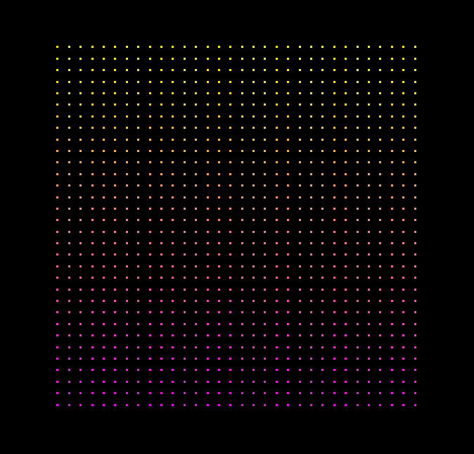

Stratified Sampling

Disc Warping (Uniform)

Disc Warping (Concentric)

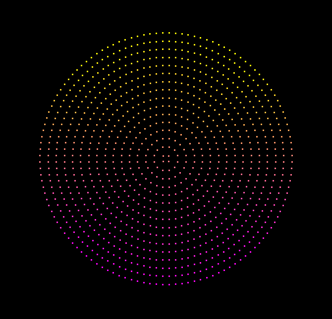

Sphere

Hemisphere (Uniform)

Hemisphere (Cosine Weighted)

Path Tracer Code
===============
Once you have implemented your sample warping functions, you can copy
your implementations of the functions in `warpfunctions.cpp` into 
`pathTracer.sampleWarping.glsl`. You will have to modify them slightly
to fit with GLSL types, but the math logic will be the same.

The path tracer base code is quite extensive, and you will need to spend
some time reading through it to understand what you're working with. There
are more files provided in the base code than we will work with for this homework;
the following is a list of classes, functions, and files that you __will__
need to examine in order to understand this assignment:
- `noOp.frag.glsl`
- `pathTracer.frag.glsl`
	- `Li_Naive()`
	- `main()`
- `pathTracer.bsdf.glsl`
	- `f_diffuse()`
	- `Sample_f_diffuse()`
- `pathTracer.sampleWarping.glsl`

Intersection functions
------------
We have provided you with implementations of various shape intersection functions, defined in `pathtracer.intersection.glsl`. Since you implemented ray-scene, ray-sphere, and ray-square intersection in homework 1, we felt it was simpler to provide you with intersection functionality in this assignment so as to reduce your search space when debugging your code. Feel free to read through this section of code in order to better understand how the provided functions work.

BSDFs
-----
You will find all of the functions used to evaluate BSDF properties in `pathtracer.bsdf.glsl`. For this homework assignment, you will just be implementing the BRDF of perfectly diffuse materials.

We have provided thoroughly-commented implementations of the `BSDF` evaluating functions
`f()`, `Sample_f()`, and `Pdf()`. Make sure you read through them
to understand what they each do.

Lambertian BRDFs (15 points)
------------
At the top of `pathtracer.bsdf.glsl`, you will find `f_diffuse()` and `Sample_f_diffuse()`. At the bottom of this file, you will also find a `TODO` comment inside `Pdf()`. For each of these functions, implement the appropriate representation of a Lambertian material. For `Sample_f()`, this means implementing cosine-weighted hemisphere sampling to generate `wi`, since while diffuse surfaces scatter light uniformly in the hemisphere, they are still affected by Lambert's Law of Cosines.

If you'd like to test your Lambertian `Sample_f` implementation, once you've begun your implementation of `Li_Naive`, you can output your `wi` direction as color (make sure to remap it from [-1, 1] to [0, 1]):

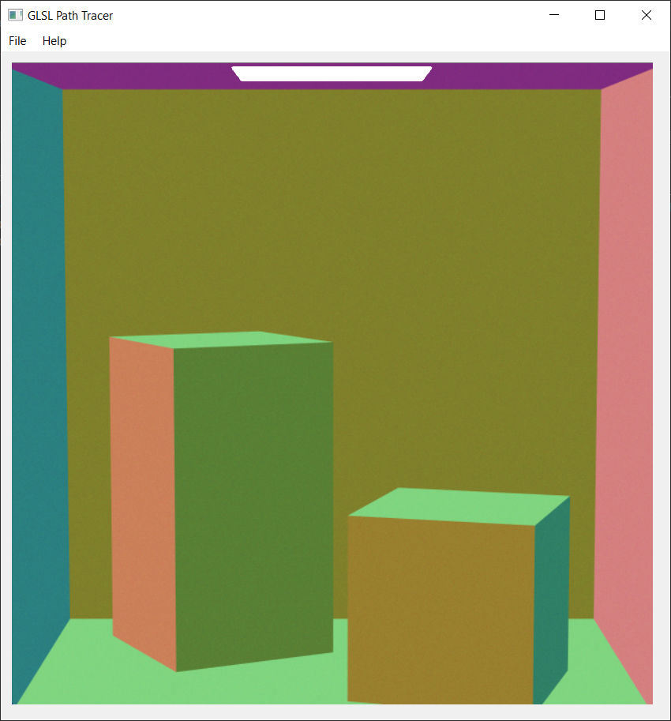

Implementing `Li_Naive` (30 points)
-------------
Within `pathtracer.frag.glsl`, you will find the `Li_Naive` function. This function should iteratively evaluate the energy emitted from the scene along a ray path back to the camera. It must find the interection of the input ray with the scene and evaluat the result of the light transport equation at the point of intersection.

Below is a list of functions and variables you will find useful while implementing `Li_Naive`:
- `sceneIntersect()`, found in `pathtracer.intersection.glsl`
- `Intersection.Le`. `Intersection` is defined in `pathtracer.defines.glsl`.
- `Intersection.material`
- `SpawnRay()`, defined in `pathtracer.defines.glsl`.
- `Sample_f()`, defined in `pathtracer.bsdf.glsl`.
- `MAX_DEPTH`, defined in `pathtracer.defines.glsl`

Additionally, here is a list of code elements you should use when implementing `Li_Naive`:
- A `vec3` you use to accumulate your ray's light energy as it bounces
- A `vec3` you use to track your ray's throughput as it bounces
- A `for` loop that iteratively bounces your ray through the scene (there is a `MAX_DEPTH` defined in `pathTracer.defines.glsl`).

Note that if the intersection with
the scene is on an object with any `Le` greater than 0, then `Li_Naive` should only
evaluate and return the light emitted directly from the intersection.

For this assignment, you only need to handle intersections whose material type is `DIFFUSE_REFL`. We will handle additional material types in future assignments.

At this point, you can produce a render, but it will only ever be a single sample per pixel of your scene. If you render the Cornell Box scene provided, it will look something like this:

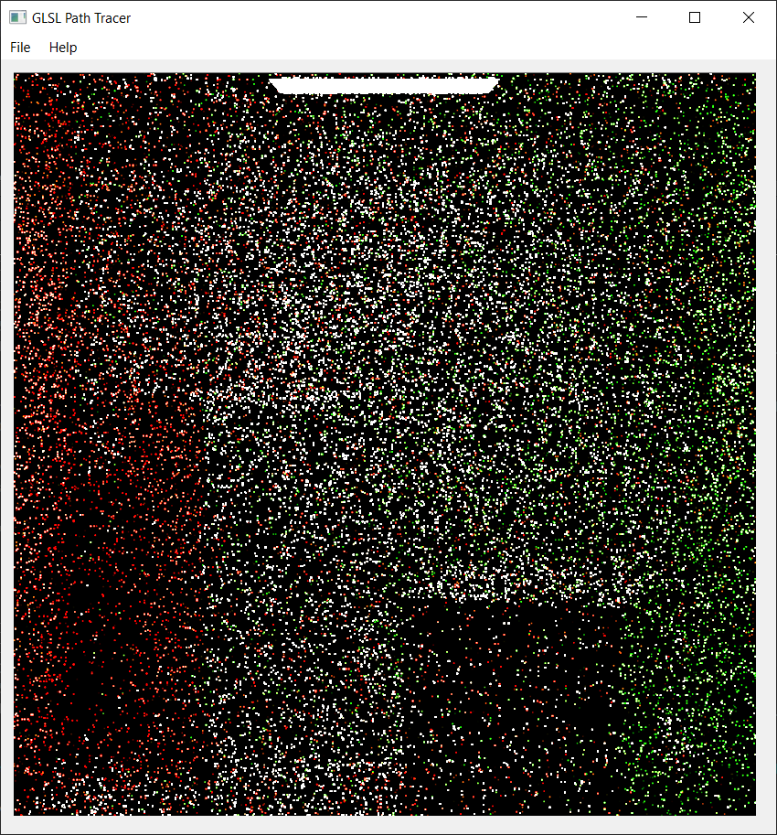

Summing up render passes in `main` (5 points)
------------
In order to produce a render that converges, you will need to add code to `main` that combines your just-computed render iteration with all of the previously computed iterations. The previous iterations are all stored in the `sampler2D` `u_AccumImg`. Use the weighted averaging method we discussed in class using the `mix` function to combine these two colors, and output their combined value. Now, after letting your Cornell Box scene converge for a few seconds, it should look something like this:

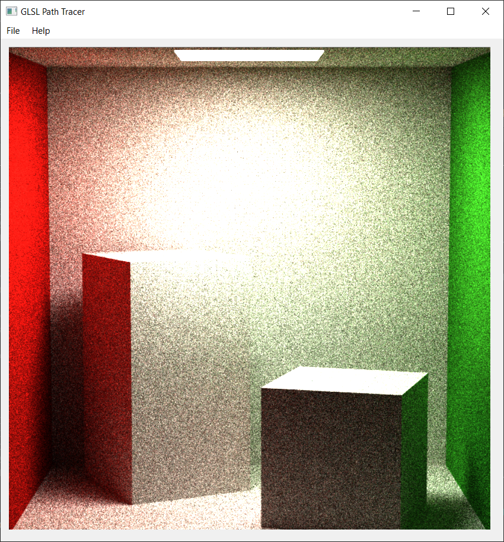

High Dynamic Range conversion (5 points)
---------
You are still missing one crucial step in making your image physically accurate. Within `noOp.frag.glsl`, there is a pair of comments referring to the Reinhard operator and gamma correction. You must take your render, which has its colors stored as high dynamic range RGB values, and convert it to standard RGB range by first applying the Reinhard operator to its colors then gamma correcting them. Once you have done this, your render should look like this:

Extra credit (30 points maximum)
-----------
In addition to the features listed below, you may choose to implement __any
feature you can think of__ as extra credit, provided you propose the idea to the
course staff through Piazza first.

#### Lambertian Transmission BTDF (5 points)
Implement a `Material` type `DIFFUSE_TRANS` which implements a Lambertian __transmission__ model. This is virtually identical to
a Lambertian reflection model, but the hemisphere in which rays are sampled is
on the other side of the surface normal compared to the hemisphere of Lambertian
reflection.

Submitting your project
--------------
Along with your project code, make sure that you fill out this `README.md` file
with your name and PennKey, along with your test renders.

Rather than uploading a zip file to Canvas, you will simply submit a link to
the committed version of your code you wish us to grade. If you click on the
__Commits__ tab of your repository on Github, you will be brought to a list of
commits you've made. Simply click on the one you wish for us to grade, then copy
and paste the URL of the page into the Canvas submission form.
